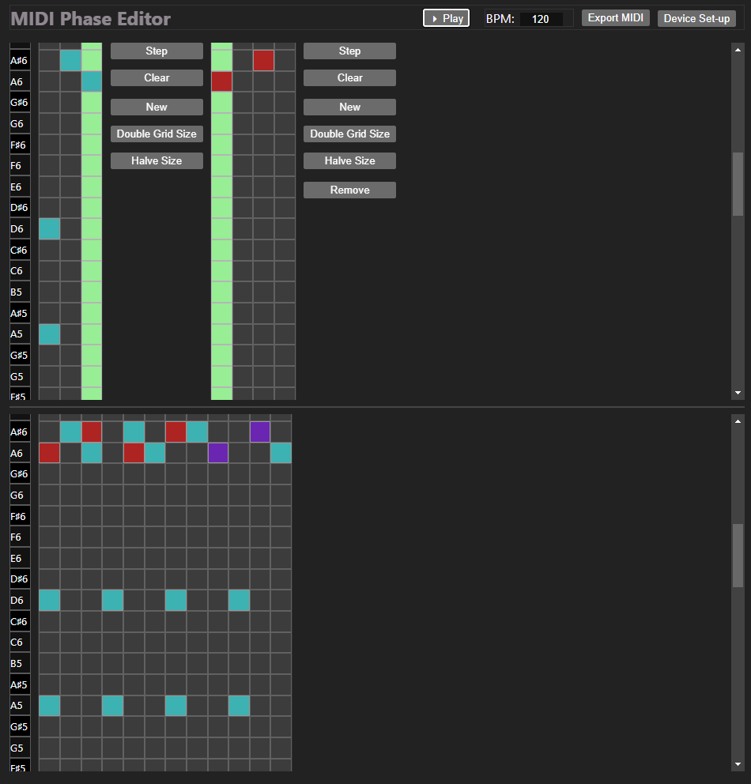

# MIDI Phase Rhythms UI

A React UI to experiment with real-time phasing of MIDI rhythms and first use of zustand.

[Demo](https://leegee.github.io/midi-phase-ui-experiment/)

# To Do

* Set cell units?

* Colour grid?

*  MIDI CLock Sync

   * https://steinberg.help/cubase_artist/v10/en/cubase_nuendo/topics/synchronization/synchronization_setup_sync_outputs_r.html

   * https://forum.kemper-amps.com/forum/thread/43271-how-to-send-midi-clock-from-cubase/

# Blah

This project was bootstrapped with [Create React App](https://github.com/facebook/create-react-app).
